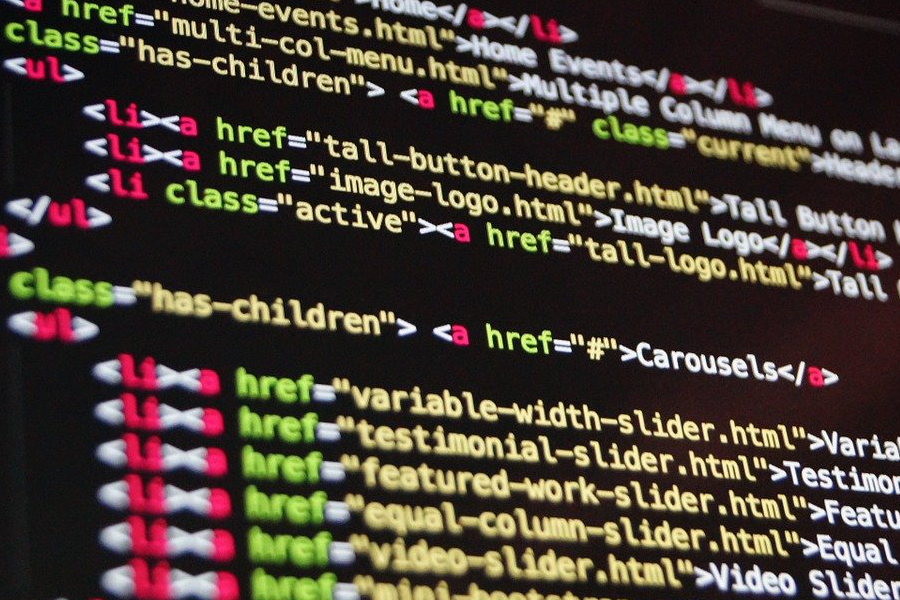

Co zrobić, aby wejść w świat IT, żeby zacząć programować? Odpowiedź jest banalnie prosta - trzeba chodzić do fizjoterapeeuty na masaże.

## Kto się nie masuje, ten nie koduje

Byłem przez chwilę bez pracy - nazwijmy to nieplanowanym urlopem. Jeszcze nawet nie przeglądałem za bardzo ogłoszeń, relaksowałem się i zbierałem siły na poszukiwania i rekrutacje. W ramach relaksu i poprawy kondycji wybrałem się do znajomego fizjoterapeuty na masaż. Świetny z niego fachowiec - grafik wypełniony po brzegi. Taki to na brak kasy nie narzeka. I na tym masażu od słowa do słowa, że programiści to ofert pracy i pieniędzy mają w brud. Tak wszyscy mówią, więc na pewno tak jest. I ten fizjoterapeuta mówi, że właśnie zaczął uczyć się programować i że mam po powrocie do domu zrobić to samo. Trafiło na podatny grunt. "Hello world!" w Pythone napisałem jeszcze tego samego dnia.

Dziś tworzę tego bloga w GatsbyJS, o którym miesiąc temu to nawet nie wiedziałem, że istnieje. To istnieje świat poza wordpressem!?

## Duże zarobki w IT? Kasa mnie nie interesuje

No tak to pewnie jeszcze nie powiedział nikt. I ja pierwszy nie będę. Pieniądze zawsze spoko, ale bardziej spoko, gdy otrzymywane za to, co się lubi robić. Bo ile wytrzymasz w robocie, gdy wykonujesz ją tylko dla pełnego konta, a naprawdę jej nie cierpisz? No może trochę wytrzymasz, ale będzie Ci smutno. Będziesz bogatym smutnym człowiekiem. Mnie do IT ciągnęło właściwie od zawsze, tylko ktoś musiał mi o tym przypomnieć. A że ktoś przypomniał, to dzięki temu od ponad pół roku większość wolnego czasu poświęcam na naukę programowania. Jeśli chcecie śledzić, jak sobie radzi w świecie ejcztiemeli, siesesów oraz dżawaskriptów blisko czterdziestoletni facet spoza branży, to świetnie trafiliście. 

